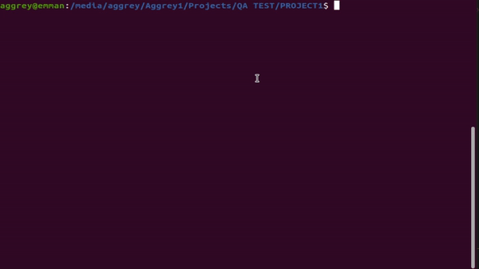

=======================================================================================

**PROJECT ONE DEPENDENCIES**

i.	psutil : this package gets properties mostly about hardware of pcs

#### the project gets the memory consumtion of the pc and logs the output to a log file

#### the project gets the cpu usage of the pc and logs the output to a log file

=====================================================================================

**PROJECT TWO DEPENDENCIES**

i.	dirsync :This package helps sync directories very efficient and have good documentation

The dirsync package has a default parameters as

sync(**source, destination, sync, logger=logger, **options**)

* The conetnt of the source and destination will always be the same
* Files already coppied to the destination will be skipped during syncronisation
* Files found in the destination that are not in source will be deleted to ensure data integrity
* All results are logged to a Log file
* The Source must be a valid directory else the process will not continue
* If destination Directory is not provided, a default desitnination Directory will be created and files will be copied into it
* File syncronisation is done in realtime

======================================================================================

**PROJECT THREE DEPENDENCIES**

* Socket IO: Helps to implement socket programming in python (communication between server and clients async)
* Select module:  This selects the incoming port and forwards it to **socket.accept()** to specify the required port to communicate with in the response and request cycle.
* pandas: Data analytics package - Used to read the csv file used to save  clients and server data
* When clients disconnect the server detects and removes them from the list of acitve clients
* When a client wants to connect, the server will require an ID from the client which must be an INT
* After the ID is provided a uniqure ID is given to the client
* After the client login the next time with its ID the server will require them to varify if they have really connect before by asking them to provide the unique ID given to them
* The server can communiate with X number of clients and data distribution to the clients flows smoothly to ensure all clients have the latest data to work with

=======================================================================================
